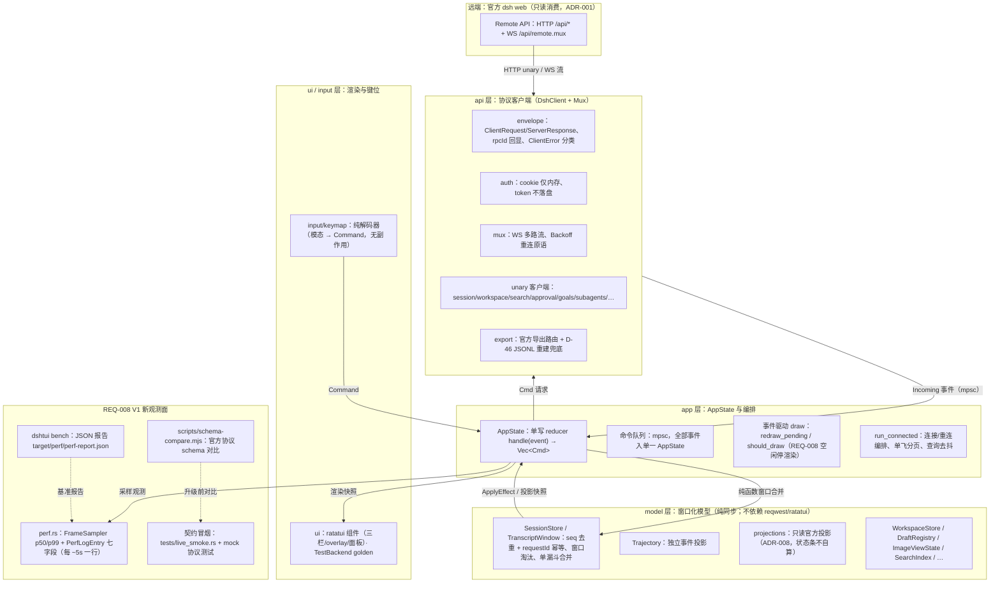

# 架构

> 依据：`src/lib.rs` 分层注释、`src/api/mod.rs`、`src/app.rs` 头部设计说明、
> `src/model/*` 各模块头部注释、`src/perf.rs`（REQ-008）。分层对齐 Notes/02 §2：
> `api`（协议客户端）→ `model`（窗口化模型）→ `app`（AppState/帧循环）→
> `ui`/`input`（渲染与键位）。

## 分层总览

## 各层说明

### api —— 协议客户端（`src/api/`）

- 所有官方 Remote API 封装集中在**这一层**，禁止散落硬编码（`api/mod.rs` 头部）。
- `DshClient`：reqwest HTTP unary（内存 cookie jar、30s 超时、无重定向）+ WS mux
  （`ws(s)://{host}/api/remote.mux`）。`connect()` 只做连接与认证——**不拉起任何后端进程**
  （ADR-001 远端客户端边界）。
- `envelope`：请求/响应信封与 rpcId 回显校验；`ClientError` 分类
  （transport/envelope/protocol/HttpStatus/PermissionDenied…），404/5xx/transport 与
  401/403 可区分（D-46/D-50 降级分类的依据）。
- `mux`：WS 多路流 + `Backoff` 重连原语；重连编排归 app 层单点（api 只提供 connect 原语）。
- 模块覆盖：`session`（follow/page/page_raw/search/…）、`workspace`、`approval`、
  `commands`、`skills`、`subagents`、`goals`、`settings`、`references`、`attachment`、
  `feedback`、`export`、`auth`、`monitor`（REQ-009 agent-server）。
- `export`：官方会话导出 + `rebuild_export_jsonl`（D-46 硬性契约兜底：官方路由
  404/5xx/transport 时，用 session/page 全量收集重建 JSONL，tmp + rename 原子落盘）。

### model —— 窗口化模型（`src/model/`）

- **纯同步、表驱动可测**：不依赖 reqwest/ratatui，是 seq/requestId/窗口容量/锚点
  的单一维护点（正确性接缝）。
- `SessionStore`/`TranscriptWindow`：snapshot/follow/page 单漏斗
  `apply(Incoming) -> ApplyEffect`；乱序事件二分插入保序，requestId 幂等优先于
  seq 去重；窗口淘汰保留 `seen_seq` 锚点；gap 修复由 follow/page 边界事实驱动。
- `Trajectory`：与转录**相互独立的投影**（V0.3，D-25）；`projections` 是 ADR-008
  口径的薄封装——**状态条数字全部来自官方 projections，TUI 从不自算**，缺失字段
  一律 None，不发明统计。
- 其余：WorkspaceStore、SearchIndex（ADR-003 nucleo 本地模糊）、DraftRegistry/
  DraftStore（ADR-010）、ImageViewState/ImageAttachment、ApprovalState、
  agent_town/kb_stats（monitor）、theme/palette 等。

### app —— AppState 与编排（`src/app.rs` + `src/main.rs`）

- 单写 reducer：`handle(event) -> Vec<Cmd>`；UI/transport 不直接持有可变模型引用
  （Step 4 原型验证）。
- 全部状态变更经 mpsc 进单一 `AppState`（单写多读）；main 为
  `tokio::main(current_thread)` 事件循环。
- 单飞分页 + generation 防过期响应；断开/重连中不发 HTTP 分页，只记 `want_backfill`，
  refollow snapshot 完成后补发（AC-001-12 重连分页对账）。
- 权限类错误（PERMISSION_DENIED）不自动重试（Notes/03 §8）；运行中会话退出顺序：
  cancel → 恢复终端 → 退出（AC-001-08）。
- **事件驱动 draw（REQ-008 Step 2）**：reducer 入口置位 `redraw_pending`，
  `should_draw(forced|pending_work|redraw_pending)` 决定是否 draw；命令/输入/事件/
  挂起重绘才 draw，空闲跳过（`draw_count`/`idle_redraws` 观测），33ms tick 保留。
- `run_connected`（主 TUI）与 `app/monitor.rs`（REQ-009 monitor 独立状态机）共用
  同一二进制。

### ui / input —— 渲染与键位（`src/ui/` + `src/input/`）

- `input/keymap`：纯解码器（消费 crossterm 事件 → 领域 Command），不触碰 AppState
  或 transport；多模态（NORMAL/Picker/Insert/Search/Visual/Approval/…/Monitor），
  `[keymap]` 配置覆盖（未知项警告保默认，永不崩溃）。
- `ui/`：ratatui 组件——三栏布局、overlay（picker/search/模型目录/命令面板/审批）、
  面板（subagent/goal/jobs/settings/skills/export/trajectory）、状态条、ImageView
  （ratatui-image Kitty 后端，ADR-005）、golden 测试用 TestBackend。

## 边界与 ADR（远端/持久化口径）

| ADR | 口径 | 代码证据 |
| --- | --- | --- |
| ADR-001 | **远端客户端**：只读消费官方 dsh web Remote API，绝不 spawn/内嵌后端 | `api/mod.rs` `DshClient::connect` 注释「does not spawn a backend process」 |
| ADR-003 | 本地 fuzzy 匹配用 nucleo，不引外部 fzf | `model/search.rs`/`catalog.rs`/`workspace.rs` |
| ADR-005 | 图片渲染 ratatui-image Kitty 后端 | Cargo.toml 注释、ImageView |
| ADR-007 | 模态隔离：模型目录/命令面板独立模态，不串 SEARCH | `app.rs` Mode 注释 |
| ADR-008 | **projections 口径**：状态条只读官方 projections，从不自算 | `model/projections.rs` 头部 |
| ADR-010 | **本地持久化边界**：仅 config.toml + drafts.toml（theme 存 config、草稿按 session 键控）；会话/凭据不落盘 | `config.rs` drafts/export 段、`model/draft_store.rs`、`model/theme.rs` |

## REQ-008（V1）新观测面

- **`src/perf.rs`**：`FrameSampler`（滑动窗口，p50/p99 线性插值口径）+ `PerfLogEntry`
  **七字段**：`ts_ms` / `rss_kb` / `frame_ms_p50` / `frame_ms_p99` / `search_ms`(可选) /
  `page_latency_ms`(可选) / `ws_reconnects`(单调计数)。主 TUI 每帧 tick、每 ~5s 追加一行
  `key=val`（配置 `[perf] log/log_path`，env `DSHTUI_PERF_LOG` 覆盖；空路径禁用）。
  `rss_mb()` 读 `/proc/self/status`；glibc `malloc_trim` 归还堆缓冲（monitor <20MB 目标）。
- **`dshtui bench`**：性能门禁基准（V1 REQ-008 新增，主会话实现中）——JSON 报告默认
  `target/perf/perf-report.json`；`--fixture auto|live|seed`、`--scenario <name>`。
- **schema-compare**：`scripts/schema-compare.mjs`（V1 REQ-008 Step 5）对比官方 `dsh web`
  两侧 `typert.remote-client.js`（zod codec bundle）结构 → SchemaDiff JSON
  （`schema_version:1`，added/removed/changed 按 path 升序，输出可重放）；喂给升级流程与
  契约冒烟（用法见 README「schema-compare」节）。
- **契约冒烟**：`tests/live_smoke.rs`（连真实后端，需 DSH_TOKEN；默认 ignored）+
  `tests/api_protocol.rs`/`export_rebuild_proto.rs` 等离线 mock 协议测试。
- **空闲停渲染**：`AppState.redraw_pending` 信号 + `should_draw` 事件驱动 draw（Step 2），
  空闲省 CPU。

## 事件循环数据流（一次典型交互）

1. 用户按键 → `input/keymap` 解码为 `Command`；
2. `Command` 经 mpsc 进 `AppState.handle()`（单写 reducer）→ 返回 `Vec<Cmd>`；
3. `Cmd` 回派：发 unary/WS 请求给 `api`，或纯函数合并进 `model`（窗口化 store）得到
   `ApplyEffect`/投影快照回写状态；
4. reducer 置位 `redraw_pending` → 事件循环 `should_draw` 为真 → `ui` 从 AppState 快照
   渲染一帧（ratatui/crossterm 输出）→ `FrameSampler.tick`；
5. 周期写 perf 行；ws 断连由 app 编排重连（monotonic 计数上报）。

## 模块地图

- 分层入口：`src/lib.rs`（pub api/app/cache/config/input/model/perf/ui）
- 主入口与编排：`src/main.rs`（CLI/config/日志/`run_connected`/monitor 分派）
- 集成测试：`tests/`（api_protocol / ui_golden / keymap / model / monitor_protocol /
  monitor_town / monitor_ui / editor_proto / keymap_override_proto / export_rebuild_proto）
